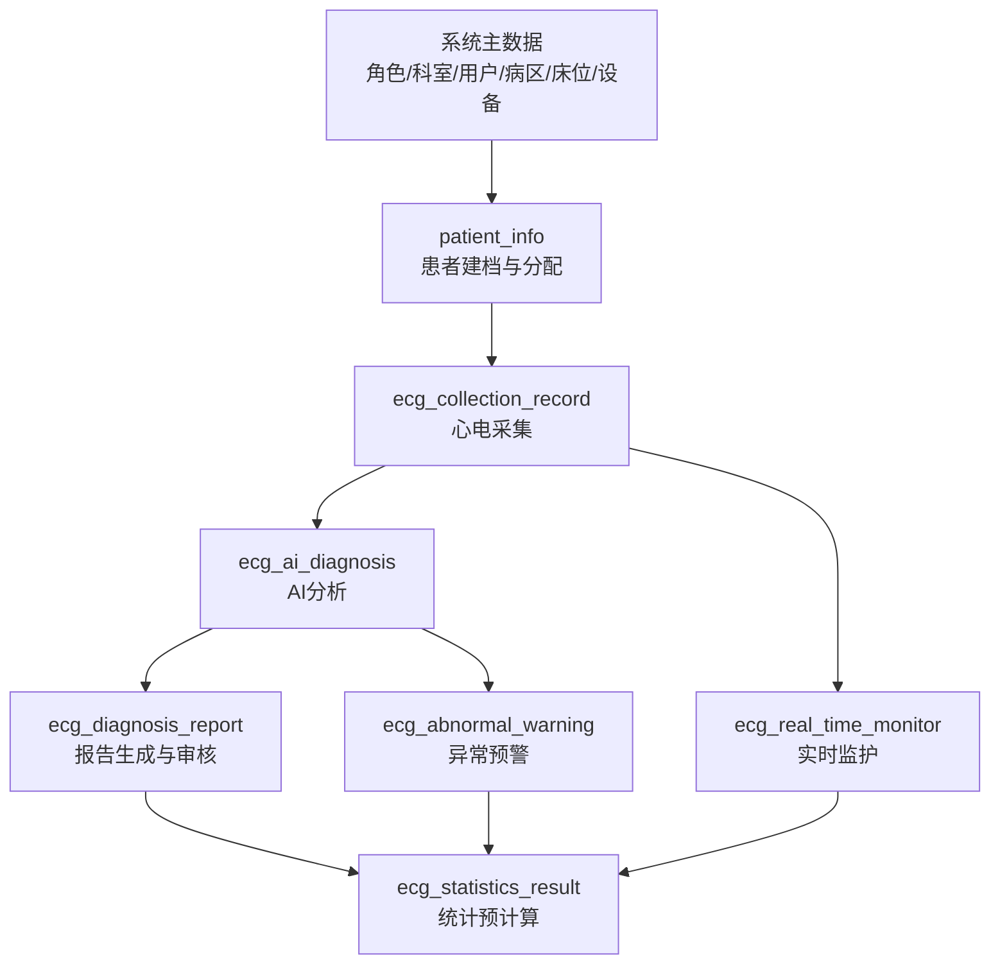

# 心电图情报分析系统：数据库业务逻辑结构与业务流程分析

## 1. 文档目标

本文基于 [init.sql](init.sql) 的表结构定义，对数据库进行两类分析：

1. 数据表业务逻辑结构：按业务域拆分表职责、关键字段、关联关系与一致性规则。
2. 数据表业务流程：按“采集-分析-报告-预警-监护-统计”主链路梳理状态流转与落库顺序。

说明：该数据库采用“业务关联ID + 冗余快照 + 逻辑删除”模型，不依赖物理外键。

---

## 2. 设计原则（从表结构反推）

### 2.1 无物理外键，业务层保障一致性

- 所有关联通过 `*_id` 字段实现，例如 `patient_id`、`record_id`、`device_id`。
- 数据库层不做 FK 约束，写入性能高，但业务层必须做完整性校验。

### 2.2 冗余快照字段驱动“单表渲染”

- 大量存在 `*_name`、`gender`、`age`、`dept_name`、`device_name` 等冗余字段。
- 目标是列表页直接单表查询，避免跨表联查带来的性能与复杂度成本。
- 历史快照可保留“当时状态”，满足医疗审计和追溯需求。

### 2.3 全表逻辑删除

- 关键表普遍使用 `is_deleted`。
- 删除后可追溯，符合医疗数据合规审计要求。

### 2.4 状态字段驱动流程

- 采集、AI、报告、预警、监护均有状态位字段。
- 业务过程不是依赖“是否存在记录”，而是依赖“状态机推进”。

---

## 3. 业务域与表职责总览

| 业务域 | 表名 | 核心职责 | 关键关联字段 |
|---|---|---|---|
| 系统权限域 | `sys_role` | 角色定义 | `role_id` |
| 系统权限域 | `sys_role_permission` | 角色-权限映射 | `role_id` |
| 系统权限域 | `sys_department` | 科室/病区/站点层级字典 | `dept_id`, `parent_id` |
| 系统权限域 | `sys_user` | 系统操作人员档案 | `role_id`, `dept_id` |
| 系统权限域 | `sys_operation_log` | 全链路操作审计 | `user_id` |
| 病区资源域 | `sys_ward` | 病区实体 | `ward_id`, `dept_id` |
| 病区资源域 | `sys_room` | 房间实体 | `room_id`, `ward_id` |
| 病区资源域 | `sys_bed` | 床位实体 | `bed_id`, `room_id`, `ward_id` |
| 患者管理域 | `patient_info` | 患者主档（全生命周期） | `patient_id`, `ward_id`, `bed_id`, `device_id` |
| 患者管理域 | `patient_follow_up_record` | 随访记录 | `patient_id`, `follow_up_user_id` |
| 设备管理域 | `ecg_device` | 设备台账 | `device_id`, `bind_dept_id` |
| 设备管理域 | `ecg_device_maintain_record` | 设备维护维修记录 | `device_id`, `maintain_user_id` |
| 设备管理域 | `ecg_device_quality_control` | 设备质控与检测记录 | `device_id`, `dept_id`, `test_user_id` |
| 心电核心域 | `ecg_collection_record` | 心电采集主记录（入口表） | `record_id`, `patient_id`, `device_id` |
| 心电核心域 | `ecg_ai_diagnosis` | AI分析结果 | `ai_diagnosis_id`, `record_id`, `patient_id` |
| 心电核心域 | `ecg_diagnosis_report` | 报告全生命周期 | `report_id`, `record_id`, `ai_diagnosis_id`, `patient_id` |
| 预警监护域 | `ecg_abnormal_warning` | 异常预警及处理闭环 | `warning_id`, `record_id`, `ai_diagnosis_id`, `patient_id` |
| 预警监护域 | `ecg_real_time_monitor` | 单患者实时监护最新态 | `monitor_id`, `patient_id` |
| 统计分析域 | `ecg_statistics_result` | 预计算统计结果 | `stat_id`, `stat_date`, `stat_type` |

---

## 4. 结构关系（业务关联，不是外键）

### 4.1 组织与床位层级

`sys_department(科室)` -> `sys_ward(病区)` -> `sys_room(房间)` -> `sys_bed(床位)` -> `patient_info(患者)`

### 4.2 核心业务主链

`patient_info` -> `ecg_collection_record` -> `ecg_ai_diagnosis` -> `ecg_diagnosis_report`

并行链路：

- 预警链：`ecg_ai_diagnosis` / 实时规则 -> `ecg_abnormal_warning`
- 监护链：设备采集流 -> `ecg_real_time_monitor`
- 管理链：`ecg_device` -> `ecg_device_maintain_record` / `ecg_device_quality_control`
- 统计链：上述业务事件聚合 -> `ecg_statistics_result`

---

## 5. 关键一致性规则（业务层必须保证）

## 5.1 主数据冗余一致性

- `sys_user.role_name` 必须与 `sys_role.role_name` 同步。
- `sys_user.dept_name`、`ecg_device.bind_dept_name`、`ecg_collection_record.dept_name` 等需与源主数据同步快照。

## 5.2 采集链路一致性

- `ecg_collection_record.patient_id`、`patient_name`、`gender`、`age`、`inpatient_no` 应与 `patient_info` 当次快照一致。
- `ecg_ai_diagnosis.record_id` 必须可追溯到采集记录。
- `ecg_diagnosis_report.record_id` 与 `ai_diagnosis_id` 应与诊断结果一一对应或可选对应。

## 5.3 状态联动一致性

- `ecg_collection_record.ai_analysis_status` 与 `ecg_ai_diagnosis.analysis_status` 必须同向推进。
- 报告审核通过/驳回时，`ecg_collection_record.report_status`、`display_status` 同步更新。
- 预警处理后需写回 `handle_user_name`、`handle_time`、`handle_opinion`，形成闭环。

## 5.4 资源占用一致性

- 患者绑定床位后，`sys_bed.bed_status` 应为已入住。
- 出院或转出后，床位状态应回写为空闲或下一状态。

---

## 6. 关键状态机（字段级）

| 表 | 状态字段 | 状态定义 | 典型流转 |
|---|---|---|---|
| `patient_info` | `patient_status` | 1住院中,2出院,3居家随访 | 1 -> 2 或 1 -> 3 |
| `patient_info` | `follow_up_status` | 0未随访,1已随访 | 0 -> 1 |
| `sys_bed` | `bed_status` | 1空闲,2已入住,3维修,4消毒中 | 1 <-> 2, 1 -> 3/4 |
| `ecg_device` | `device_status` | 1正常,2维修,3停用,4离线 | 1 <-> 2, 1 -> 4 |
| `ecg_collection_record` | `record_status` | 1采集中,2完成,3失败 | 1 -> 2 或 1 -> 3 |
| `ecg_collection_record` | `ai_analysis_status` | 0待分析,1分析中,2已分析,3失败 | 0 -> 1 -> 2/3 |
| `ecg_collection_record` | `report_status` | 0未生成,1待审核,2已审核,3驳回 | 0 -> 1 -> 2/3 |
| `ecg_collection_record` | `display_status` | 0待分析,1已分析,2已审核,3已驳回,4采集失败 | 由多个状态综合映射 |
| `ecg_ai_diagnosis` | `analysis_status` | 0待分析,1分析中,2完成,3失败 | 0 -> 1 -> 2/3 |
| `ecg_ai_diagnosis` | `is_abnormal`/`abnormal_level` | 0正常,1异常 + 风险级别 | 结果态直接写入 |
| `ecg_diagnosis_report` | `report_status` | 0草稿,1待审核,2通过,3驳回,4作废 | 0/1 -> 2/3/4 |
| `ecg_abnormal_warning` | `handle_status` | 0待确认,1待处理,2处理中,3已处理,4已忽略 | 0 -> 1 -> 2 -> 3 或 0/1 -> 4 |
| `ecg_real_time_monitor` | `monitor_status` | 1正常,2预警,3离线 | 高频动态切换 |

---

## 7. 端到端业务流程（按落库顺序）

## 7.1 流程A：主数据准备

1. 维护组织与权限：`sys_role`、`sys_role_permission`、`sys_department`、`sys_user`。
2. 维护资源：`sys_ward`、`sys_room`、`sys_bed`。
3. 维护设备台账：`ecg_device`，并持续写入维护/质控记录。

## 7.2 流程B：患者入院/建档

1. 在 `patient_info` 建立患者档案。
2. 分配病区/床位/设备，回写冗余展示字段。
3. 变更床位状态（已入住）。

## 7.3 流程C：心电采集与AI诊断

1. 采集写入 `ecg_collection_record`，状态为采集中或完成。
2. AI任务读取采集记录，写入 `ecg_ai_diagnosis`。
3. AI结论摘要回写 `ecg_collection_record.ai_conclusion_short`，并推进 `ai_analysis_status` / `display_status`。

## 7.4 流程D：报告生成与审核

1. 医生根据 AI 结果生成 `ecg_diagnosis_report`。
2. 审核通过或驳回后，联动更新 `ecg_collection_record.report_status` 和 `display_status`。

## 7.5 流程E：预警闭环

1. 当 `is_abnormal=1` 且达到阈值（如 `abnormal_level>=2`）时写入 `ecg_abnormal_warning`。
2. 处理人接单推进 `handle_status`，写回处理意见、时间、人员。

## 7.6 流程F：实时监护与统计

1. 高频监护数据按患者维度 UPSERT 到 `ecg_real_time_monitor`（单患者单记录）。
2. 定时/实时聚合写入 `ecg_statistics_result`，支撑报表和大屏。

---

## 8. 业务流程图（Mermaid）

---

## 9. 查询层典型落地方式

## 9.1 列表页（单表优先）

- 心电数据管理：直接查 `ecg_collection_record`。
- AI诊断中心：直接查 `ecg_ai_diagnosis`。
- 报告管理：直接查 `ecg_diagnosis_report`。
- 预警监控：直接查 `ecg_abnormal_warning`。

## 9.2 详情页（多表按业务ID关联）

- 患者详情：`patient_info` + 采集历史 + 报告历史 + 随访历史。
- 设备详情：`ecg_device` + 维护记录 + 质控记录。

---

## 10. 现有脚本中的注意点（分析结论）

1. `patient_info` 下方业务注释中仍出现 `current_dept_id/current_dept_name` 字样，属于历史字段描述，当前表结构已改为 `ward_id` + `bed_id`。
2. 多处表的 `dept_id` 语义存在“科室ID”与“病区ID”混用现象，建议在应用层增加统一字典映射与命名约束，避免跨模块误用。
3. `ecg_collection_record.display_status` 属于聚合展示状态，建议明确状态计算优先级，避免并发更新时出现短暂不一致。

---

## 11. 推荐的应用层防线

1. 写入前校验：所有 `*_id` 在主表中可查且未逻辑删除。
2. 事务边界：采集->AI->报告联动更新建议使用事务或可靠事件机制。
3. 幂等策略：AI分析、实时监护UPSERT、统计重算都需要幂等键。
4. 审计完整性：关键状态变更必须同步写 `sys_operation_log`。

---

## 12. 结论

该库是典型的“医疗业务快照型宽表+状态机驱动”设计：

- 在性能层面，依靠冗余字段实现高频列表页低成本查询。
- 在业务层面，通过多个状态字段串联流程，形成采集、诊断、审核、预警、监护、统计的闭环。
- 在治理层面，需要应用层承担强一致性校验、状态联动与审计落账责任。
